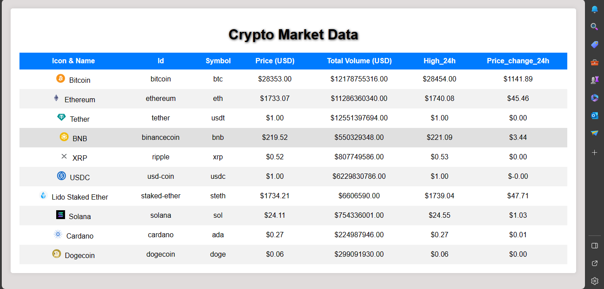

## Crypto Market Data
Live Demo: https://sakshi-rah.github.io/Sakshi_Rahangdale_DOM_final_6th_Oct_23/
<h2>1. Project Overview -: </h2>

- The CryptoMarket Dashboard is a web application that fetches cryptocurrency market data from the CoinGecko API and displays it in a user-friendly table format on a webpage. This project demonstrates the use of promises and the async-await method in JavaScript to handle API requests and display data. It also includes styling based on a provided sample image from Figma.

<h2>2. Project Description -:</h2> 

The CryptoMarket Dashboard is designed to fetch cryptocurrency market data from the CoinGecko API, store it in an array, and display it on a webpage in the form of a table. It employs JavaScript promises (using the .then method) and async-await methods for handling API requests. Additionally, the displayed data adheres to specific styling guidelines as per a provided sample image from Figma.

<h2>3. Data Storage -:</h2>

- The fetched data is stored in an array, with each object containing the following fields:

        1. Name
        2. ID
        3. Image URL
        4. Symbol
        5. Current Price
        6. Total Volume

<h2>4. Displaying Data -:</h2>

- HTML Table
An HTML table is created to display the cryptocurrency market data.

- Populating the Table
JavaScript is used to dynamically populate the table rows with data from the array.

- Styling
CSS styles are applied to the table to match the provided sample image from Figma.

<h2>5. Additional Features -: </h2>

- Coin Icons and Names
- Coin icons and names are displayed together in the table.
- Percentage Change Color
- The percentage change is displayed in green for positive values and red for negative values.
- Dollar Sign ($)
- Dollar signs ($) are added to numerical values (current price and total volume) as shown in the sample image.
- 
## Output: 

